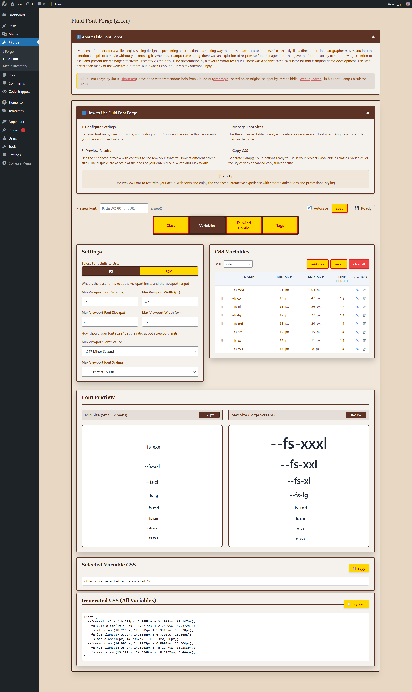

# Fluid Font Forge


[](https://github.com/jimrweb/fluid-font-forge)
[](https://wordpress.org/)
[](LICENSE)
[](https://php.net/)

A WordPress admin plugin for generating CSS clamp() functions for responsive typography. Provides a calculator interface for creating fluid font scaling between viewport sizes.

Fluid Font Forge transforms how you implement responsive typography in WordPress. Instead of manually creating breakpoints for different screen sizes, this plugin generates mathematically precise CSS clamp() functions that scale typography fluidly across all viewport widths.





## Overview

Fluid Font Forge generates CSS clamp() functions that allow font sizes to scale smoothly between minimum and maximum viewport widths. The plugin provides:
- Mathematical scaling ratios for typography hierarchy
- Four output formats: CSS classes, custom properties, HTML tags, and Tailwind config
- Real-time preview at minimum and maximum viewport sizes
- Drag-and-drop reordering of font sizes
- Configurable line heights and custom naming

### Key Features

**Advanced Typography Calculator**
- Mathematical scaling using configurable ratios (Minor Second to Octave)
- Precise viewport range control (minimum to maximum screen widths)
- Real-time font size calculation with instant preview
- Support for both px and rem units with accessibility considerations

**Professional Interface**
- Drag-and-drop size management for easy reordering
- Real-time preview showing actual scaling behavior at min/max viewports
- Modal editing system for detailed size customization
- Copy-to-clipboard functionality for immediate implementation

**Multiple Output Formats**
- CSS Classes (.large, .medium, .small)
- CSS Custom Properties (--fs-lg, --fs-md, --fs-sm)  
- HTML Tag Styles (h1, h2, p, etc.)
- Tailwind Configuration Objects (fontSize export)

**WordPress Integration**
- Works with any theme (block themes, classic themes, custom themes)
- Compatible with page builders (Elementor, Gutenberg, Beaver Builder)
- No external dependencies - fully self-contained
- Performance optimized with local processing

## Installation

1. Download the plugin files to `/wp-content/plugins/fluid-font-forge/`
2. Activate through WordPress admin
3. Navigate to **J Forge → Fluid Font** in the admin menu

## Usage

### Basic Configuration

1. **Set Viewport Range**: Configure minimum and maximum viewport widths (default: 375px to 1620px)
2. **Set Font Size Range**: Configure root font sizes at each viewport (default: 16px to 20px)
3. **Choose Scaling Ratios**: Select mathematical ratios for typography scaling
4. **Select Base Size**: Choose which size represents your base font size

### Output Formats

#### CSS Classes
```css
.large {
  font-size: clamp(1.25rem, 0.89rem + 1.8vw, 2.67rem);
  line-height: 1.4;
}
```

#### CSS Custom Properties
```css
:root {
  --fs-lg: clamp(1.25rem, 0.89rem + 1.8vw, 2.67rem);
}
```

#### HTML Tag Styling
```css
h1 {
  font-size: clamp(2.07rem, 1.33rem + 3.7vw, 4.77rem);
  line-height: 1.2;
}
```

#### Tailwind Config
```javascript
module.exports = {
  theme: {
    extend: {
      fontSize: {
        'base': 'clamp(1.000rem, 0.901rem + 0.49vw, 1.266rem)',
        'lg': 'clamp(1.125rem, 1.001rem + 0.62vw, 1.424rem)'
      }
    }
  }
}
```

## Features
### Typography Scaling

| Scale Name | Ratio | Best For |
|------------|-------|----------|
| Minor Second | 1.067 | Subtle, tight spacing |
| Major Second | 1.125 | Clean, modern sites |
| Minor Third | 1.200 | Balanced hierarchy |
| Major Third | 1.250 | Strong contrast |
| Perfect Fourth | 1.333 | Bold, dramatic |
| Golden Ratio | 1.618 | Harmonious, classic |

### Interface Features
- Real-time preview of font sizes at minimum and maximum viewports
- Editable size names and line heights
- Drag-and-drop reordering
- Copy-to-clipboard functionality
- Custom font preview (WOFF2 font loading)
- Autosave capability

## Technical Requirements

- WordPress 5.0+
- PHP 7.4+
- Modern browsers supporting CSS clamp() (Chrome 79+, Firefox 75+, Safari 13.1+, Edge 79+)

## Browser Support

CSS clamp() functions work in:
- Chrome 79+ (March 2020)
- Firefox 75+ (April 2020)
- Safari 13.1+ (March 2020)
- Edge 79+ (January 2020)

For older browsers, consider providing fallback font sizes.

## Plugin Architecture

```
fluid-font-forge/
├── fluid-font-forge.php              # Main plugin file
├── includes/
│   ├── class-fluid-font-forge.php    # Main plugin class
│   └── class-default-data-factory.php # Default data provider
├── assets/
│   ├── css/admin-styles.css          # Admin interface styles
│   └── js/admin-script.js            # Admin interface JavaScript
└── uninstall.php                     # Cleanup on uninstall
```

## Development

### Setup
```bash
git clone https://github.com/jimrweb/fluid-font-forge.git
cd fluid-font-forge
```

### Contributing
1. Fork the repository
2. Create a feature branch
3. Follow WordPress coding standards
4. Test thoroughly
5. Submit a pull request

## Mathematical Background

The plugin uses CSS clamp() with linear interpolation between viewport sizes:

```
clamp(min_size, preferred_size, max_size)
```

Where preferred_size is calculated as:
```
preferred_size = intersection + slope * viewport_width
```

- **slope**: (max_size - min_size) / (max_viewport - min_viewport)
- **intersection**: y-intercept of the scaling line

## License

GPL v2 or later - see [LICENSE](LICENSE) file.

## Credits

- Developed by [Jim R.](https://jimrweb.com)
- Development assistance from Claude AI (Anthropic)
- Inspired by Imran Siddiq's Font Clamp Calculator (WebSquadron)

## Support

- **Bug Reports**: [GitHub Issues](https://github.com/jimrweb/fluid-font-forge/issues)
- **Feature Requests**: [GitHub Issues](https://github.com/jimrweb/fluid-font-forge/issues)
- **Documentation**: [GitHub Wiki](https://github.com/jimrweb/fluid-font-forge/wiki)

---

## Acknowledgments

- **Jim R.** ([JimRWeb](https://jimrweb.com)) - Original concept and development
- **Claude AI** ([Anthropic](https://anthropic.com)) - Development assistance and architecture
- **Imran Siddiq** ([WebSquadron](https://websquadron.co.uk)) - Original Font Clamp Calculator inspiration

---

<div align="center">

**Made with ❤️ for the WordPress developer community**
</div>