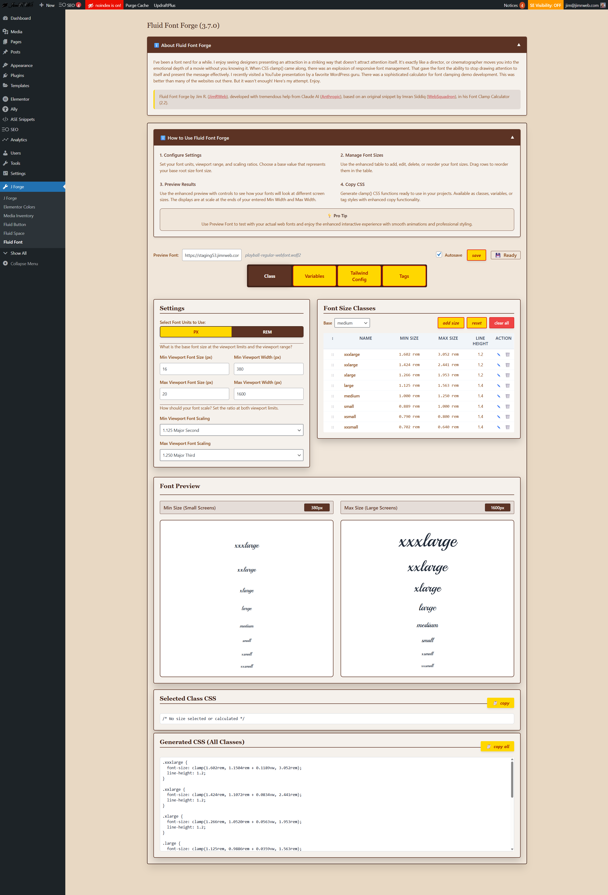

# Fluid Font Forge - WordPress Admin Code Snippet


**Professional responsive typography tool for WordPress developers**

[](https://github.com/your-username/fluid-font-forge)
[](https://wordpress.org/)
[](LICENSE)
[](https://php.net/)

> Transform your WordPress site's typography with mathematically precise, responsive font scaling using CSS clamp() functions.
> 
> Fluid Font Forge is a WordPress Admin snippet that will work with you generating the font clamping functions for your typography.



## ✨ Why Fluid Font Forge?

As a WordPress developer, you know the pain of managing typography across devices. Fluid Font Forge eliminates guesswork and delivers pixel-perfect responsive typography that scales beautifully from mobile to desktop.

### 🎯 Perfect For
- **WordPress Theme Developers** building custom themes
- **Agency Developers** working with Elementor, Bricks, or custom builders  
- **Tailwind CSS Projects** needing fluid typography integration
- **Freelancers** who want professional typography systems
- **Anyone** tired of media query breakpoint madness

---

## 🚀 Key Features

### **📐 Mathematical Precision**
- **Typography Scales**: Minor Second (1.125), Major Third (1.250), Golden Ratio (1.618), and more
- **Viewport-Based Scaling**: Perfect fluid typography between any screen sizes

### **🎨 Four Output Modes**
```css
/* CSS Classes */
.large { font-size: clamp(1.25rem, 0.89rem + 1.8vw, 2.67rem); }
```

```css
/* CSS Custom Properties */
:root { --fs-lg: clamp(1.25rem, 0.89rem + 1.8vw, 2.67rem); }
```

```css

/* Direct HTML Tag Styling */
h1 { font-size: clamp(2.07rem, 1.33rem + 3.7vw, 4.77rem); }
```

```javascript
/* Tailwind Config Integration */
module.exports = {
  theme: {
    extend: {
      fontSize: {
        'xs': 'clamp(0.790rem, 0.730rem + 0.30vw, 1.000rem)',
        'sm': 'clamp(0.889rem, 0.811rem + 0.39vw, 1.125rem)',
        'base': 'clamp(1.000rem, 0.901rem + 0.49vw, 1.266rem)',
        'lg': 'clamp(1.125rem, 1.001rem + 0.62vw, 1.424rem)'
      }
    }
  }
}
```

### **⚡ Developer-Friendly Interface**
- **Live Preview**: See fonts at min/max viewport widths instantly
- **Four Output Formats**: CSS Classes, Variables, Tailwind Config, or HTML Tags
- **Not Limited**: Edit, delete, and reorder font sizes
- **Line Heights**: Set custom line heights for each size
- **Rename**: Choose meaningful names (classes, variables - HTML tags are fixed)
- **Tailwind Integration**: Ready-to-use JavaScript objects for tailwind.config.js
- **Accurate**: Mathematical scaling ensures perfect proportions
- **Drag & Drop**: Reorder font sizes with smooth animations
- **Copy to Clipboard**: One-click CSS copying with success feedback
- **Custom Font Testing**: Load WOFF2 fonts to preview with your actual typefaces
- **Autosave**: Never lose your work

### **🏗️ Professional Architecture**

- **WordPress Standards**: Proper hooks, nonces, sanitization, and caching
- **Performance Optimized**: Minimal database queries, static caching
- **Accessible**: WCAG compliant with keyboard navigation and screen readers

---

## 🎮 Quick Start Guide

### 1. Choose Your Mode
- **Classes**: CSS classes for utility-first CSS frameworks
- **Variables**: CSS Custom Variables for design systems and CSS custom properties  
- **Tailwind Config**: JavaScript objects for direct Tailwind CSS integration
- **Tags**: For automatic HTML element styling

### 2. Configure Your Base Settings

```
Defaults:
Min Viewport Font Size: 16px    (font size mobile)
Min Viewport Width: 375px (device width mobile)
Min Viewport Font Scaling: 1.250 (major third scale ratio)
Max Viewport Font Size: 20px    (font size desktop)
Max Viewport Width: 1620px (device width desktop)
Max Viewport Font Scaling: 1.333 (perfect fourth scale ratio)
```

### 3. Customize Your Font Sizes
- If necessary, edit names, line heights, and ordering for your configuration
- Preview changes in real-time
- Fluid Font Forge will use mathematical scaling to build the necessary CSS results for you

### 4. Copy Your CSS
Click the copy button to get production-ready CSS:

```css
.xlarge {
  font-size: clamp(1.78rem, 1.28rem + 2.5vw, 3.55rem);
  line-height: 1.2;
}

.large {
  font-size: clamp(1.33rem, 1.01rem + 1.6vw, 2.67rem);
  line-height: 1.4;
}

.medium {
  font-size: clamp(1rem, 0.82rem + 0.9vw, 2rem);
  line-height: 1.4;
}
```

---

## 💡 Advanced Usage

### Custom Typography Scales
Perfect mathematical ratios for professional typography:

| Scale Name | Ratio | Best For |
|------------|-------|----------|
| Minor Second | 1.067 | Subtle, tight spacing |
| Major Second | 1.125 | Clean, modern sites |
| Minor Third | 1.200 | Balanced hierarchy |
| Major Third | 1.250 | Strong contrast |
| Perfect Fourth | 1.333 | Bold, dramatic |
| Golden Ratio | 1.618 | Harmonious, classic |

### Integration Examples

#### With CSS Classes (Classes tab)
```html
<h1 class="xxxlarge">Hero Headline</h1>
<h2 class="xlarge">Section Title</h2>
<p class="medium">Body text that scales perfectly</p>
```

#### With CSS Custom Properties (Variables tab)
```css
.hero-title {
  font-size: var(--fs-xxxl);
  font-weight: 700;
}

.card-title {
  font-size: var(--fs-lg);
  color: var(--primary-color);
}
```

#### With Tailwind CSS (Tailwind Config tab)
```javascript
// Copy this into your tailwind.config.js
module.exports = {
  theme: {
    extend: {
      fontSize: {
        'xs': 'clamp(0.790rem, 0.730rem + 0.30vw, 1.000rem)',
        'sm': 'clamp(0.889rem, 0.811rem + 0.39vw, 1.125rem)', 
        'base': 'clamp(1.000rem, 0.901rem + 0.49vw, 1.266rem)',
        'lg': 'clamp(1.125rem, 1.001rem + 0.62vw, 1.424rem)',
        'xl': 'clamp(1.266rem, 1.111rem + 0.77vw, 1.602rem)',
        '2xl': 'clamp(1.424rem, 1.234rem + 0.95vw, 1.802rem)',
        '3xl': 'clamp(1.602rem, 1.370rem + 1.16vw, 2.027rem)',
        '4xl': 'clamp(1.802rem, 1.521rem + 1.40vw, 2.281rem)'
      }
    }
  }
}
```

```html
<!-- Use with standard Tailwind classes -->
<h1 class="text-4xl font-bold text-blue-600">Fluid Headline</h1>
<h2 class="text-2xl font-semibold">Responsive Subtitle</h2>
<p class="text-base">Body text that scales beautifully</p>

<!-- Combine with responsive utilities -->
<div class="text-base md:text-lg lg:text-xl">
  Fluid scaling PLUS responsive breakpoints
</div>
```

#### Direct HTML Styling (Tags tab)
```html
<!-- No classes needed - automatic scaling -->
<h1>This headline scales automatically</h1>
<h2>So does this subtitle</h2>
<p>And this body text</p>
```

---

## 🏗️ Technical Architecture

### Key Features for Developers

#### WordPress Best Practices
- Proper sanitization and validation
- Nonce verification for security
- Action/filter hooks for extensibility
- Caching for performance
- Accessibility compliance

#### JavaScript Architecture
- Modular ES6+ classes
- Event-driven communication between components
- Debounced input handling
- Drag & drop with visual feedback
- Keyboard shortcuts support

#### Tailwind CSS Integration
- Native fontSize configuration
- No build step required for clamp() functions
- Works with Tailwind's JIT compiler
- Automatic purging of unused styles
- Compatible with all Tailwind utilities

---

## 🧪 Browser Support

- **Modern Browsers**: Full support with all features
- **Mobile**: Fully responsive with touch-friendly interactions
- **Accessibility**: Screen reader support and keyboard navigation

## 🧪 CSS clamp() Support
CSS clamp() is supported in:
- Chrome 79+
- Firefox 75+  
- Safari 13.1+
- Edge 79+

---

## 📚 Examples & Use Cases

### E-commerce Sites
Perfect for product listings with consistent typography scaling:
```css
.product-title { font-size: var(--fs-lg); }
.product-price { font-size: var(--fs-xl); }
.product-description { font-size: var(--fs-md); }
```

### Tailwind CSS Projects
Seamless integration with existing Tailwind workflows:
```html
<div class="bg-white rounded-lg shadow-lg p-6">
  <h3 class="text-2xl font-bold mb-4">Card Title</h3>
  <p class="text-base text-gray-600 mb-6">
    Description with fluid typography
  </p>
  <button class="text-sm bg-blue-500 text-white px-4 py-2 rounded">
    Call to Action
  </button>
</div>
```

### Blog & Content Sites
Maintain readability across all devices:
```css
h1 { font-size: clamp(1.75rem, 1.2rem + 2.75vw, 3.5rem); }
.post-excerpt { font-size: clamp(0.9rem, 0.8rem + 0.5vw, 1.1rem); }
```

### Landing Pages
Hero sections that scale dramatically:
```css
.hero-headline { 
  font-size: clamp(2.5rem, 1.5rem + 5vw, 6rem);
  line-height: 1.1;
}
```

---

## 🤝 Contributing

We welcome contributions! Here's how to get started:

1. **Fork the repository**
2. **Create a feature branch**: `git checkout -b feature/amazing-feature`
3. **Make your changes** following WordPress coding standards
4. **Test thoroughly** across different viewports and browsers
5. **Submit a pull request** with a clear description

### Development Setup
```bash
# Clone your fork
git clone https://github.com/your-username/fluid-font-forge.git

# Install development dependencies
composer install
npm install

# Run tests
composer test
npm run test
```

---

## 📄 License

This project is licensed under the MIT License - see the [LICENSE](LICENSE) file for details.

---

## 🙏 Acknowledgments

- **Jim R.** ([JimRWeb](https://jimrweb.com)) - Original concept and development
- **Claude AI** ([Anthropic](https://anthropic.com)) - Development assistance and architecture
- **Imran Siddiq** ([WebSquadron](https://websquadron.co.uk)) - Original Font Clamp Calculator inspiration

---

## 📞 Support & Questions

- **Issues**: [GitHub Issues](https://github.com/your-username/fluid-font-forge/issues)
- **Discussions**: [GitHub Discussions](https://github.com/your-username/fluid-font-forge/discussions)
- **Website**: [JimRWeb.com](https://jimrweb.com)

---

<div align="center">

**Made with ❤️ for the WordPress developer community**

[⭐ Star this repo](https://github.com/your-username/fluid-font-forge) if it helps your projects!

</div>