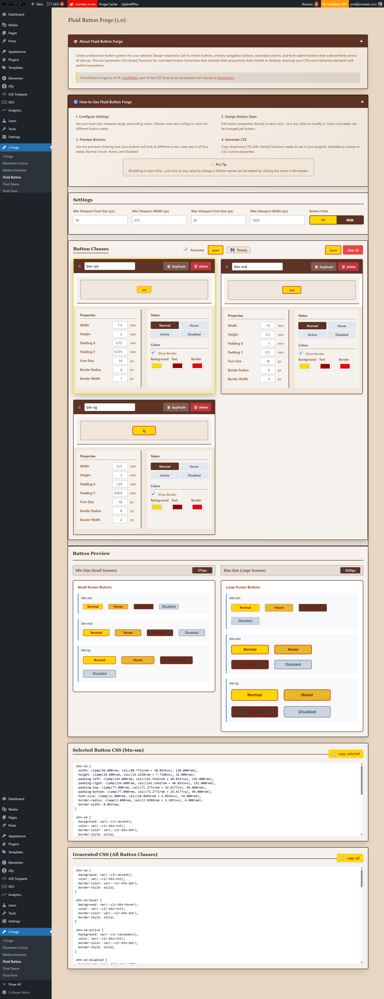

# 🎨 Fluid Button Forge - WordPress Admin Code Snippet


**Professional responsive design tools for WordPress developers**

Create stunning, responsive button hierarchies that scale perfectly across all devices! The Fluid Button Forge generates professional CSS using modern `clamp()` functions, ensuring your buttons maintain perfect proportions from mobile to desktop.



## ✨ Why Use Fluid Button Forge?

**No more guesswork.** Design once, work everywhere. Create consistent button systems that automatically adapt to any screen size while maintaining your brand's visual hierarchy.

- **🎯 Professional Results**: Generate pixel-perfect button systems used by top agencies
- **📱 Truly Responsive**: Uses CSS `clamp()` for smooth scaling across all devices  
- **⚡ Framework Ready**: Perfect for Elementor, Bricks, Gutenberg, and custom themes
- **🎨 Design System Approach**: Create consistent button hierarchies (small, medium, large)
- **🚀 Performance Optimized**: Clean, minimal CSS with no JavaScript dependencies

---

## 🔧 How It Works

The Fluid Button Forge generates two types of CSS output:

### 1. **CSS Classes** - Direct Implementation
```css
.btn-sm { /* Small CTA buttons */ }
.btn-md { /* Primary action buttons */ }  
.btn-lg { /* Hero CTA buttons */ }
```

### 2. **CSS Custom Properties** - Maximum Flexibility
```css
:root {
  --btn-sm-width: clamp(96px, calc(0.75rem + 2.4vw), 120px);
  --btn-sm-height: clamp(26px, calc(0.5rem + 1.6vw), 32px);
  /* ... and more */
}
```

---

## 🎯 Perfect Use Cases

### **Call-to-Action (CTA) Buttons**
Create button hierarchies that guide user attention:
- **Large (btn-lg)**: Hero sections, primary CTAs, "Get Started" buttons  
- **Medium (btn-md)**: Secondary actions, "Learn More", navigation buttons
- **Small (btn-sm)**: Tertiary actions, "Skip", "Cancel", form buttons

### **E-commerce & Marketing**
- Shopping cart buttons that scale beautifully on mobile
- Pricing table CTAs with consistent visual weight
- Newsletter signup buttons that convert on any device
- Product page "Add to Cart" buttons with perfect touch targets

### **Forms & User Interface**  
- Submit buttons that feel substantial on desktop, thumb-friendly on mobile
- Multi-step form navigation with clear visual hierarchy
- Login/register buttons with professional polish

---

## 🏗️ Implementation Guide

### **Method 1: Direct CSS Classes (Recommended)**

**Step 1:** Copy the generated CSS from Fluid Button Forge
**Step 2:** Add to your WordPress theme's `style.css` or child theme
**Step 3:** Apply classes directly to your buttons

```html
<!-- Elementor Button Widget -->
<a href="#signup" class="btn-lg">Start Free Trial</a>

<!-- Bricks Button Element -->  
<button class="btn-md">Learn More</button>

<!-- Any HTML Button -->
<button class="btn-sm">Cancel</button>
```

### **Method 2: CSS Custom Properties (Advanced)**

Perfect for page builders and custom implementations:

```css
.my-hero-button {
  width: var(--btn-lg-width);
  height: var(--btn-lg-height);
  font-size: var(--btn-lg-font-size);
  /* Apply your own colors and styling */
}
```

---

## 🎛️ Page Builder Integration

### **Elementor Integration**

#### **Button Widget:**
1. Add Button widget to your page
2. Go to **Advanced > Custom CSS**
3. Add your button class:
```css
selector {
  width: var(--btn-lg-width) !important;
  height: var(--btn-lg-height) !important;
  font-size: var(--btn-lg-font-size) !important;
}
```

#### **Call-to-Action Widget:**
1. Design your CTA layout normally
2. For the button element, apply `btn-lg` class in **Advanced > CSS Classes**
3. The button automatically inherits responsive scaling

#### **Form Widgets:**
- **Submit Buttons**: Apply `btn-md` for primary form actions
- **Secondary Buttons**: Use `btn-sm` for "Reset" or "Cancel" actions  
- **Multi-step Forms**: Use `btn-lg` for final submission, `btn-sm` for navigation

### **Bricks Builder Integration**

#### **Button Element:**
1. Select your Button element
2. Go to **Style > Custom CSS** 
3. Add button class or custom properties:
```css
element {
  width: var(--btn-md-width);
  height: var(--btn-md-height);
  /* Your custom styling */
}
```

#### **Form Builder:**
1. Style form submit buttons with `btn-md` class
2. Apply to **Element > Attributes > Class**
3. Buttons automatically scale responsively

---

## 🎨 Pro Design Tips

### **Create Visual Hierarchy**
- **Hero CTAs**: Use `btn-lg` with high contrast colors
- **Secondary Actions**: Use `btn-md` with subtle styling  
- **Tertiary Actions**: Use `btn-sm` with minimal styling

### **Maintain Consistency**
- Use the same button classes across your entire site
- Stick to your defined color palette for all button states
- Test button touch targets on mobile (minimum 44px recommended)

### **Responsive Strategy**
- Large buttons (btn-lg) shine on desktop hero sections
- Medium buttons (btn-md) work perfectly in content areas
- Small buttons (btn-sm) are ideal for mobile-first designs

---

## 🚀 Quick Start Examples

### **Landing Page Hero**
```html
<div class="hero-section">
  <h1>Transform Your Business Today</h1>
  <a href="#signup" class="btn-lg">Get Started Free</a>
  <a href="#demo" class="btn-md">Watch Demo</a>
</div>
```

### **E-commerce Product**
```html
<div class="product-actions">
  <button class="btn-lg add-to-cart">Add to Cart - $49</button>
  <button class="btn-md wishlist">♡ Add to Wishlist</button>
  <button class="btn-sm share">Share</button>
</div>
```

### **Contact Form**
```html
<form class="contact-form">
  <!-- form fields -->
  <div class="form-actions">
    <button type="submit" class="btn-md">Send Message</button>
    <button type="reset" class="btn-sm">Clear Form</button>
  </div>
</form>
```

---

## 💡 Why This Approach Works

**Traditional Approach**: Set fixed pixel sizes, fight with media queries, hope it looks good.

**Fluid Button Forge Approach**: Define your design system once, generate responsive CSS that scales beautifully across all devices using modern CSS techniques.

**Result**: Professional button systems that work everywhere, save development time, and create better user experiences.

---

## 🛠️ Technical Requirements

- **WordPress 5.0+** (for admin interface)
- **Modern Browsers** (supports CSS `clamp()` - 95%+ browser support)
- **No JavaScript Dependencies** (pure CSS solution)
- **Compatible with**: Any WordPress theme, Elementor, Bricks, Gutenberg, custom development

---

*Ready to create professional button systems? Download Fluid Button Forge and transform your WordPress site's user interface today!*